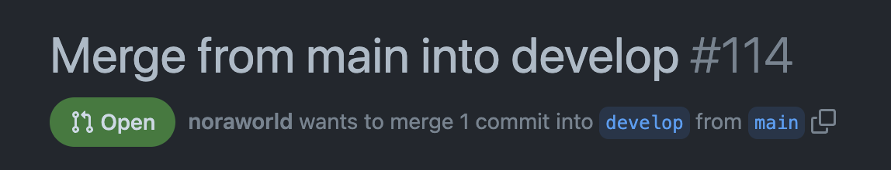
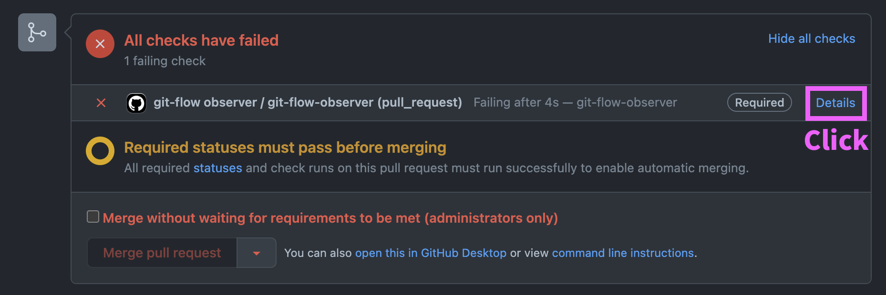
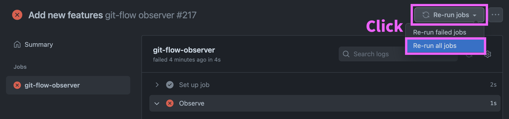
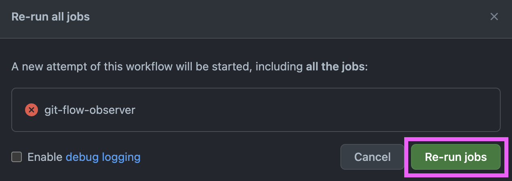
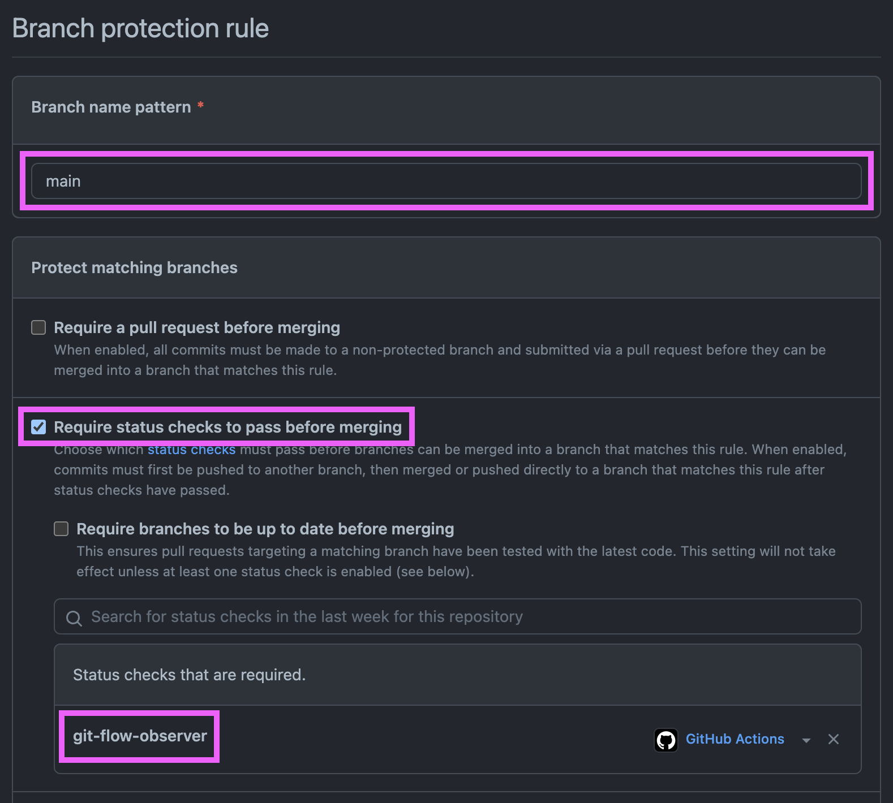

# git-flow observer


## Installation
It’s super easy to install git-flow observer to your GitHub repository. All you have to do is add the following YAML code to your repository as `.github/workflows/git-flow-observer.yml`.

```yaml
# .github/workflows/git-flow-observer.yml

name: "git-flow observer"

on: pull_request

jobs:
  git-flow-observer:
    if: github.head_ref != 'main' || github.base_ref != 'develop'
    runs-on: ubuntu-latest
    steps:
      - name: "Observe"
        uses: noraworld/git-flow-observer@latest
        with:
          head: "develop"
          base: "main"
```

Replace a part of the above YAML code with the following.

| Key                                         | Description                                                         | Required | Sample Value                                                |
| ------------------------------------------- | ------------------------------------------------------------------- | :------: | ----------------------------------------------------------- |
| `jobs.git-flow-observer.if`                 | Specify conditions when to skip a job                               | False    | `github.head_ref != 'main' || github.base_ref != 'develop'` |
| `jobs.git-flow-observer.steps[*].with.head` | Specify a branch name as basis for comparison                       | True     | `"develop"`                                                 |
| `jobs.git-flow-observer.steps[*].with.base` | Specify a branch name that is checked whether or not fast-forwarded | True     | `"main"`                                                    |

That’s done!


## Common questions
### What if it fails?

1. Make a head branch fast-forwarded

First, you need to make a head branch fast-forwarded. In most cases, it can be resolved by creating and merging a new pull request from a base branch into a head branch.



2. Re-run jobs

Then re-run jobs referring to the following screenshots.







### How can I force PRs to require status checks to pass before merging?

You can set this up in your repository settings.

1. Head over to `Settings` (in your repository) > `Branches`, and click `Add rule`

HINT: `Settings` is in your repository, not your account settings.

2. Enter a branch name pattern you want to set up, enable `Require status checks to pass before merging`, and add git-flow observer to the status checks list



3. Click a `Create` button at the bottom of the page

4. Repeat the procedure 1 through 3 for every branch

HINT: It is recommended to set up in both your head and base branches.
